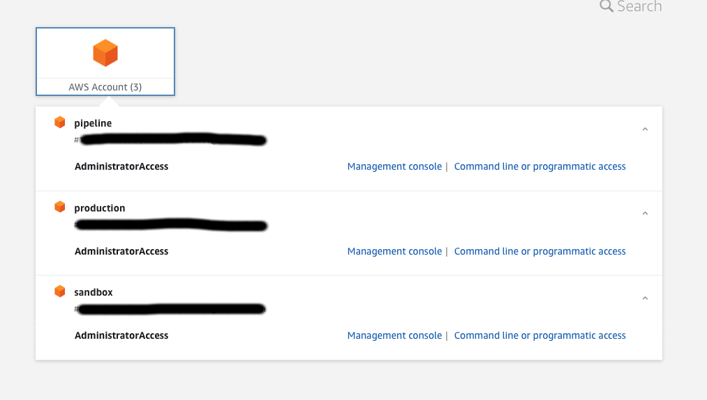
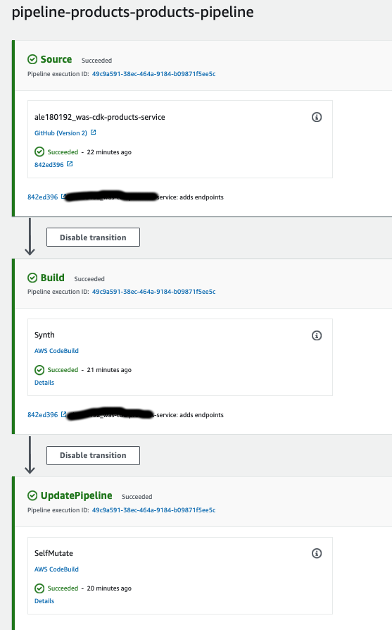

# General
Este proyecto implementa un simple catalogo de productos

## Operaciones soportadas
#### Productos
Solo los usuarios autenticados pueden crear y actualizar los productos, para listar los productos no es necesario credencial alguna.
* Crear un producto -> Necesita autorizacion
* Actualzar un producto -> Necesita autorizacion
* Listar todos los productos

#### Usuarios
* Signup
* Login

## Estructura del proyecto
Este proyecto utilza un enfoque de microservicios(serverless), para el despliegue de la infraestructura se toma el enfoque de infraestructura como codigo utiliando AWS CDK, En la misma infraestructura vive un pipeline que esta conectado al repositorio de github, cuando se hace un merge hacia la rama master este pipeline se ejectuta. Toda la definicion de la infraestructura esta alojada en la carpeta `infraestructura`.

La API REST con todos los endpoints vive en la carpeta `src`, Utilizamos `Fast API` como framework de desarrollo junto con `Mangum` para poder lograr que la lamda tenga un unico handler y este MANGUN handler se encarga de hacer todo el enrutamiento necesario. La API REST se estructuro con un enfoque de arquitectura hexagonal(DDD o arquitectura limpia), esto con el objetivo de tener desacomplados nuestro dominio de la db, framework web, etc.

# AWS CDK
La cuenta root de aws tiene 3 cuentas con el objetivo de separar ambientes, costos y accessos/credenciales.
* Cuenta pipeline -> aqui se aloja el pipeline, este pipeline tiene permisos para hacer el despliegue en la cuenta de sandbox y la cuenta de produccion
* Cuenta sandbox -> Como primer paso el pipeline realiza el despliegue en esta cuenta de manera automatica cada vez que se hacer un merge hacia master.
* Cuenta de produccion -> Despues de que el pipeline se desplego exitosamente en el sandbox, existe un paso donde se tiene que realizar la aprovacion manual, despues de esto el pipeline continua haciendo el despliegue a esta cuenta de produccion.

## Accounts
Tener diferentes cuentas en AWS nos brinda una mayor seguridad ya que podemos otorgar permisos a los usuarios por cuenta, podemos facilmente obtener la facturacion por cuenta y sobre todo podemos aislar logicamente nuestros recursos.

## Pipeline

Tenemos un pipeline en aws codepipeline, el cual consiste unicamente en desplegar nuestra aplicacion de cdk. es decir este esta escuchando los tiggers de github para la rama de master, cuando existe un tigger como primer paso se valida que el pipeline no haya cambiado, esto es porque el pipeline tambien esta definido como codigo(infraestructura como codigo), si el pipeline se actualizo este mismo se automuta y posteriormente continua desplegando los recursos de aws(lambdas, api gateways, etc). Cabe destacar que el pipeline corre en una cuenta de AWS especifica, pero el despliegue lo realiza en dos cuentas diferentes, en la cuenta sandbox y en la cuenta de produccion.


#### Otorgando permisos a la cuenta del pipeline para realizar despliegues en las otras 2 cuentas.
```bash
# Cuenta donde se despliega el pipeline. Credenciales de la cuenta pipeline
cdk bootstrap --bootstrap-customer-key --cloudformation-execution-policies 'arn:aws:iam::aws:policy/AdministratorAccess' aws://<pipeline-account-xxx>/<region-xxx> --profile sso-pipeline

# credenciales de la cuenta de sandbox
cdk bootstrap --bootstrap-customer-key --cloudformation-execution-policies 'arn:aws:iam::aws:policy/AdministratorAccess' --trust <pipeline-account-xxx> aws://sandbox-account/<region> --profile sso-sandbox

# credenciales de la cuenta de prod
cdk bootstrap --bootstrap-customer-key --cloudformation-execution-policies 'arn:aws:iam::aws:policy/AdministratorAccess' --trust <pipeline-account-xxx> aws://prod-account/<region> --profile sso-prod

# Hacemos el deploy
cdk diff --profile sso-pipeline --all --app infrastructure/cdk.out
cdk deploy --profile sso-pipeline --all --app infrastructure/cdk.out
```

# PRODUCTS API REST
Products service es una API Rest que utiliza Fast Api como framework web junto con Mangun para lograr que una unica funcion lambda pueda tener uno o varios endpoints, se prefiere el enfoque de una unica lambda ya que esto nos reduce drasticamente el tiempo de despliegue(solo se tiene que construir una imagen docker).

Como se menciona el microservicio tiene una arquitectura serverless, usa AWS lambdas, AWS API Gateway y DynamoDb para darle persistencia a nuestros datos.

Para desarrollar nuevos features o simplemente levantar localmente el microservicio basta con crear un entorno virtual de python, instalar las dependencias, configurar localmente nuestra instancia de dynamoDb y por ultimo ejectuar nuestro servidor de Fast Api.

Install the requirements on Mac and activate the env
```bash
# Create python environment.
python3 -m venv .env-lambdas
# activates python environment.
source .env-lambdas/bin/activate
# Installs dependencies into the python environment.
pip install -r src/lambdas/requirements.txt
```

Configurate the local dynamodb instance. for this one we use docker-compose.
```bash
cd src/
docker-compose up
```

### Create the tables
TODO: adds local migrations to the local dynamodb

Run uvicorn server. It is important to set the ENVIRONMENT variable=local in order to use the local dynamodb instance.
```bash
cd src
ENVIRONMENT=local uvicorn lambdas.handler:app --reload
```


# Others
#### Adds boto3 typping to Vs Code
https://pypi.org/project/boto3-stubs/


### Feature flags deployments
We implement CI/CD for this service, we use Trunk based development in order to do the deploys, if there are no much developers working at the same time, there is not problem to merge to the main branch then await the deploy into the sandbox environment finishes and does the manually test(only if there is another test that the unit test does not cover.), if we have success with the tests then we click on the manually step to approve the deploy to the production environment, but if we detect some issues on the tests that we did then we can do the fixes without worrying about stopping the changes/code of the others developers. But if more than one developer is working in the repository then we need to be able to do deploy using our feature branch where we are working, it is to say, When we do push of our feature branch we need something that creates a new infraestructure and makes the deploy of our code, with this we can easily do the test having an isolete box which has the last changes of the main branch, and when the branch is deleted it also deletes the infraestructure, and then we can send the merge to the main branch which raises all the pipeline up to the production deploy.
Here we have a article where it talks about how we can use github actions in order to resolve this problem.